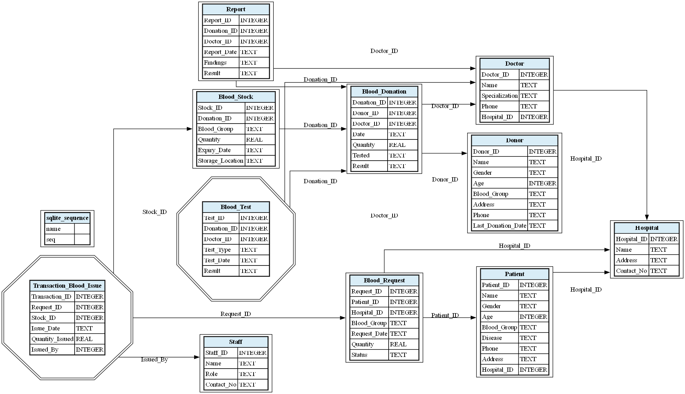

# 🧩 ER Diagram Generator (Flask + SQLite + Graphviz)

Automatically generate **ER (Entity-Relationship) Diagrams** from any uploaded `.db` or `.sqlite` database file — right from your browser!  
This project uses **Flask**, **SQLite**, and **Graphviz** to visualize your database schema beautifully with solid relationships and customizable weak entities.

---

## 🚀 Features

✅ Upload your SQLite `.db` file directly  
✅ Auto-detect **many-to-many relationships**  
✅ Select **weak entities** manually via a simple web interface  
✅ Clean **solid-line** relationships (no dotted mess!)  
✅ Auto-generated ER Diagram in PNG format  
✅ Download diagram or view it directly in the browser  
✅ Simple and modern UI  

---

## 🖼️ Example Output

Below is an example of a generated ER Diagram (for demonstration):



*(Tip: Add your own real output image in this path, e.g. `static/example_er_diagram.png`)*

---

## 🧠 How It Works

1. **Upload** a `.db` or `.sqlite` file  
2. App automatically reads your schema using SQLite’s metadata  
3. You can **choose which entities are weak** via checkboxes  
4. App generates a **Graphviz-based ER diagram**  
5. ER Diagram and a summary table are displayed:
   - 📘 Weak Entities (selected by user)  
   - 🔗 Many-to-Many Relationships (auto-detected)

---

## ⚙️ Installation & Setup
   pip install flask graphviz

### 1️⃣ Clone the Repository
```bash
git clone https://github.com/ZohaiAli/er-diagram-generator.git
cd er-diagram-generator
